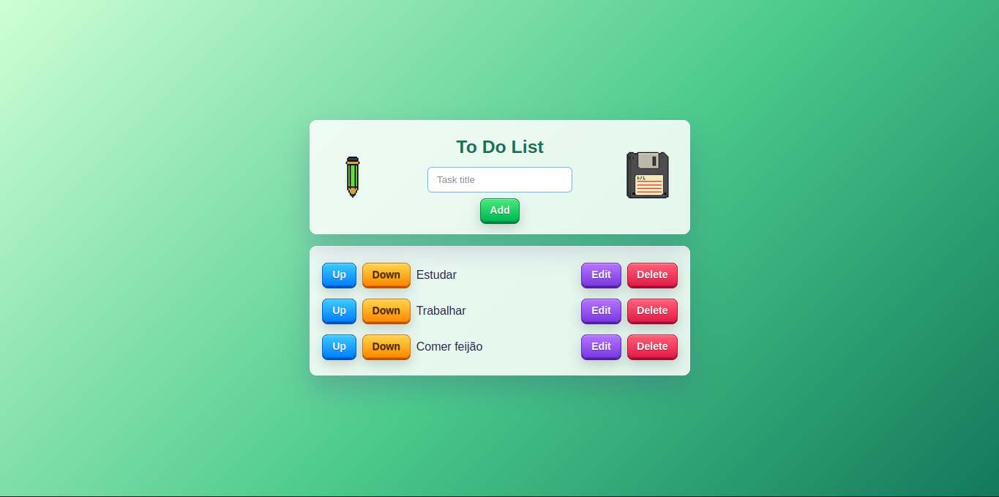

# To Do List Frontend

Frontend de uma aplicação de lista de tarefas desenvolvida com React e Vite. A aplicação permite criar, listar, editar, deletar e reorganizar tasks consumindo uma API Rest (Spring Boot) externa.

## Preview



## Stacks

- React
- Vite
- JavaScript
- CSS Modules
- Axios

## Backend

Deploy do backend no Render, com API Spring Boot e banco de dados PostgreSQL.

API: `https://to-do-list-pe2n.onrender.com`

## Conceitos Aplicados

- Requisições HTTP com Axios.
- Controle de estado com `useState`.
- Efeitos com `useEffect`.
- Componentização em React.
- Uso de props e children.
- Estilização com CSS Modules.

## Como Funciona

O frontend carrega as tasks da API, exibe a lista na tela e permite criar, editar, deletar e reorganizar os itens. As ações principais disparam requisições HTTP para o backend, mantendo a interface sincronizada com os dados persistidos.

O objetivo do projeto foi aplicar conhecimentos de desenvolvimento fullstack, integrando um frontend em React com um backend em Java e banco PostgreSQL.

## Rodando Localmente

Instale as dependências:

```bash
npm install
```

Crie um arquivo `.env` na raiz do projeto:

```env
VITE_API_URL=https://to-do-list-pe2n.onrender.com
```

Inicie o projeto:

```bash
npm run dev
```
